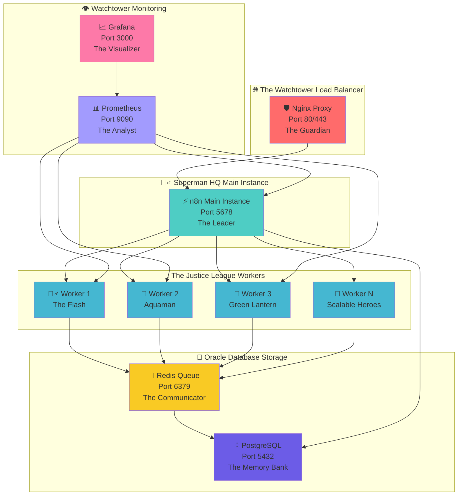

# 🦸‍♂️ n8n Superman AI - The Automation Hero Gotham Deserves!

<div align="center">


*"With great automation comes great responsibility"* - Uncle Ben (probably)

</div>

## 🌟 Overview

Welcome to **n8n Superman AI** - the most powerful, horizontally scalable n8n automation platform this side of Metropolis! 🏙️

Just like Superman can handle multiple crises simultaneously across the globe, this setup can handle thousands of concurrent workflow executions across multiple worker instances. Whether you're automating Lex Luthor's defeat or just organizing your daily tasks, this platform has got your back!

**What makes this setup super?**
- 🚀 **Faster than a speeding bullet**: Queue-based execution with Redis
- 💪 **More powerful than a locomotive**: Horizontal scaling with multiple workers
- 🦸‍♂️ **Able to leap tall buildings**: Load balancing with Nginx
- 🔍 **X-ray vision**: Comprehensive monitoring and health checks
- 🛡️ **Fortress of Solitude**: Production-ready security features

## 🏗️ The Justice League Architecture

*"Even Superman needs a team!"* - This architecture brings together the best heroes for maximum automation power!

<div align="center">



</div>

### 🦸‍♂️ Meet Your Automation Heroes:

- **🛡️ Nginx (The Guardian)**: Protects and routes all incoming requests like Batman's security system
- **⚡ n8n Main (Superman)**: The primary instance that coordinates everything with super speed
- **🏃‍♂️ Workers (The Flash & Team)**: Lightning-fast execution of your automation workflows
- **📡 Redis (Oracle)**: The communication hub that keeps everyone connected and informed
- **🗄️ PostgreSQL (The Fortress)**: Secure, reliable storage for all your precious data
- **📊 Monitoring Stack (Watchtower)**: Keeps an eye on everything, just like the Justice League's headquarters

## 🦸‍♂️ Superpowers & Features

### ⚡ **The Flash's Speed** - Horizontal Scaling
*"I am the fastest automation alive!"*

- 🏃‍♂️ **Multiple n8n worker instances** - Deploy an army of speedsters for parallel execution
- 📡 **Queue-based execution** - Redis coordinates tasks like Barry Allen coordinates time
- ⚖️ **Load balancing** - Nginx distributes work faster than you can say "Speed Force"
- 🔄 **Auto-scaling capabilities** - Automatically summon more heroes when the city needs saving
- 🎯 **Resource optimization** - Every CPU cycle counts when you're saving the world

### 🚀 **Superman's Strength** - Performance Optimizations
*"Up, up, and away... to maximum performance!"*

- 🧠 **Redis queue management** - Distributed execution with Kryptonian efficiency
- 🗄️ **Optimized PostgreSQL** - Connection pooling stronger than Superman's grip
- 💾 **Resource limits** - CPU/memory reservations that even Doomsday can't break
- 🏥 **Health checks** - Constant monitoring like Superman's X-ray vision
- 📝 **Comprehensive logging** - Every action recorded in the Fortress of Solitude

### 🛡️ **Batman's Security** - Fort Knox Protection
*"I am the night... and your data is safe with me!"*

- 🔒 **Network isolation** - Each service in its own Batcave
- 🔐 **Environment variables** - Secrets protected better than Bruce Wayne's identity
- 🌐 **SSL/TLS support** - Encryption worthy of Wayne Enterprises
- 🛡️ **Security headers** - Rate limiting that would make the Joker cry
- 🔑 **Proper authentication** - Multi-layer security like the Batcave's defenses

### 👁️ **Oracle's Vision** - Monitoring & Observability
*"I see everything, and so will you!"*

- 📊 **Prometheus metrics** - Data collection with superhuman precision
- 📈 **Grafana dashboards** - Visualizations prettier than Metropolis at sunset
- ⏱️ **Real-time monitoring** - Faster updates than Clark Kent's news articles
- 📡 **Queue metrics** - Track every workflow like tracking every villain
- 💻 **Resource usage** - Monitor everything like the Watchtower monitors Earth

### 🛠️ **Cyborg's Tech** - Production Features
*"Booyah! Everything's automated!"*

- 🔄 **Automatic restarts** - Self-healing like Wolverine (wait, wrong universe!)
- 💾 **Data persistence** - Named volumes more reliable than the Daily Planet's archives
- 💿 **Backup and restore** - Data protection worthy of the Hall of Justice
- 📏 **Scaling management** - Scripts smoother than Clark Kent's transitions
- 🚀 **Deployment automation** - One-click deployment faster than a speeding bullet

## 🚀 Quick Start - Become a Hero in 4 Steps!

*"Every hero needs an origin story. Here's yours!"*

### 🛠️ **Step 0: Assemble Your Arsenal** (Prerequisites)

Before you can save the world, make sure you have the right tools:

| Requirement | Minimum | Recommended | Why You Need It |
|-------------|---------|-------------|-----------------|
| 🐳 **Docker Engine** | 20.10+ | Latest | Your superhero suit |
| 🐙 **Docker Compose** | 2.0+ | Latest | Your utility belt |
| 💾 **RAM** | 4GB | 8GB+ | More memory = more power |
| 💿 **Disk Space** | 20GB | 50GB+ | Room for all your victories |
| ⚡ **CPU Cores** | 2 cores | 4+ cores | Speed of The Flash |

### 🦸‍♂️ **Step 1: Deploy Your Fortress of Solitude**

```bash
# 🚀 The Superman way (Automated deployment)
./scripts/deploy-scaled.sh

# 🦇 The Batman way (Manual control)
docker compose up -d
```

<div align="center">

</div>

### 👥 **Step 2: Assemble Your Justice League** (Scale Workers)

```bash
# 🏃‍♂️ Summon 5 speedster workers
./scripts/scale-n8n.sh scale 5

# 🤖 Enable auto-scaling (like having Oracle manage your team)
./scripts/scale-n8n.sh auto

# 👁️ Check your team status
./scripts/scale-n8n.sh status
```

### 📊 **Step 3: Activate Your Watchtower** (Monitor Performance)

```bash
# 👁️ Real-time hero dashboard
./scripts/monitor-performance.sh monitor

# 📡 Check Redis communications
./scripts/monitor-performance.sh redis

# 🌍 Monitor everything at once
./scripts/monitor-performance.sh all
```

### 🌐 **Step 4: Access Your Command Centers**

| Service | URL | Description | Hero Equivalent |
|---------|-----|-------------|-----------------|
| 🦸‍♂️ **n8n Interface** | http://localhost:5678 | Your main control panel | Superman's Fortress |
| 🛡️ **Nginx Proxy** | http://localhost:80 | Load balancer gateway | Watchtower Entry |
| 📊 **Prometheus** | http://localhost:9090 | Metrics collection | Oracle's Database |
| 📈 **Grafana** | http://localhost:3000 | Visual dashboards | Batcave Monitors |
| 🗄️ **PostgreSQL** | localhost:5432 | Main database | Hall of Records |
| 📡 **Redis** | localhost:6379 | Queue management | Communication Hub |

<div align="center">

</div>

## ⚙️ Configuration - Your Hero's Secret Identity

*"Every superhero needs a secret identity. Here's how to configure yours!"*

### 🔐 Environment Variables - The Secret Files

Create your `.env` file from the sample (like creating your superhero alter ego):

```bash
# Copy the sample configuration
cp .env_sample .env

# Edit with your super-secret values
nano .env  # or vim, if you're feeling like Batman
```

<details>
<summary>🦸‍♂️ <strong>Essential Configuration (Click to expand your powers!)</strong></summary>

| Variable | Description | Example | Hero Notes |
|----------|-------------|---------|------------|
| 🌐 `N8N_HOST` | Your domain name | `your-domain.com` | Your public superhero identity |
| 🔒 `N8N_PROTOCOL` | http or https | `https` | Always use https in production! |
| 👤 `POSTGRES_USER` | Database username | `n8n-postgres` | Your database alter ego |
| 🔑 `POSTGRES_PASSWORD` | Database password | `super-secret-123` | Stronger than Superman's grip |
| 🔐 `N8N_ENCRYPTION_KEY` | Encryption key (32+ chars) | `your-32-char-encryption-key-here` | Guard this like the Batcave location |
| 📡 `REDIS_PASSWORD` | Redis password | `redis-secret-456` | Communication encryption |

</details>

<details>
<summary>⚡ <strong>Advanced Configuration (For experienced heroes)</strong></summary>

| Variable | Description | Default | When to Use |
|----------|-------------|---------|-------------|
| 🏃‍♂️ `EXECUTIONS_MODE` | Execution mode | `queue` | Always use `queue` for scaling |
| 👥 `N8N_WORKERS_ENABLED` | Enable workers | `true` | Required for horizontal scaling |
| 🔢 `N8N_WORKER_CONCURRENCY` | Worker concurrency | `10` | How many tasks per worker |
| 📧 `N8N_EMAIL_MODE` | Email notifications | `smtp` | For workflow notifications |
| 🌍 `TIMEZONE` | Server timezone | `UTC` | Set to your location |

</details>

## 🏥 Health Monitoring - Your Personal Alfred

*"Master Bruce, all systems are operating at optimal capacity!"*

### 🔍 The Health Check Script - Your Digital Alfred

```bash
# 🏥 Run comprehensive health check (like Alfred checking on Batman)
./scripts/health-check.sh

# 📊 What it checks:
# ✅ Docker environment status
# ✅ Container health and uptime
# ✅ Database connectivity
# ✅ Redis queue status
# ✅ Network accessibility
# ✅ Resource usage
```

<div align="center">

</div>

## 💾 Backup & Restore - Your Fortress Archives

*"Even Superman keeps backups in the Fortress of Solitude!"*

### 📦 Create Your Digital Time Capsule

```bash
# 💿 Create full backup (like storing memories in the Fortress)
./scripts/backup.sh

# 🗄️ What gets backed up:
# • All workflow data
# • User configurations
# • Database snapshots
# • Environment settings
# • Custom integrations
```

### 🔄 Restore from Backup

```bash
# 🔄 Restore from backup (when Lex Luthor strikes)
./scripts/restore.sh backup-2024-01-15.tar.gz

# ⚠️ Warning: This will restore everything to the backup state
# Make sure to stop all services first!
```

## 🔍 Troubleshooting - When Villains Attack!

*"Even Superman has bad days. Here's how to handle yours!"*

### 🚨 Common Villains (Issues) and How to Defeat Them

<details>
<summary>🦹‍♂️ <strong>The "n8n Won't Start" Villain</strong></summary>

*When your automation hero refuses to wake up:*

```bash
# 🔍 Investigate like Batman
docker compose logs n8n

# 🗄️ Check if the database is being stubborn
docker compose logs postgres

# 💪 Sometimes you need the Superman approach (restart everything)
docker compose restart

# 🔄 Nuclear option (when Doomsday attacks)
docker compose down -v && docker compose up -d
```

</details>

<details>
<summary>🗄️ <strong>The "Database Connection" Nemesis</strong></summary>

*When PostgreSQL is having a Lex Luthor moment:*

```bash
# 🏥 Check if PostgreSQL is alive
docker exec n8n_postgres pg_isready -U n8n-postgres

# 🔍 Investigate database logs
docker compose logs postgres

# 🔄 Reset the database (last resort!)
docker compose down -v
docker compose up -d
```

</details>

<details>
<summary>⚡ <strong>The "Redis Queue" Troublemaker</strong></summary>

*When your communication hub goes silent:*

```bash
# 📡 Check Redis connectivity
docker compose exec redis redis-cli ping

# 📊 Monitor queue status
./scripts/monitor-performance.sh redis

# 🔄 Restart Redis service
docker compose restart redis
```

</details>

<details>
<summary>🌐 <strong>The "Nginx Load Balancer" Chaos</strong></summary>

*When your guardian isn't guarding:*

```bash
# 🛡️ Check Nginx status
docker compose logs nginx

# 🔍 Test configuration
docker compose exec nginx nginx -t

# 🔄 Reload configuration
docker compose exec nginx nginx -s reload
```

</details>

## 🛡️ Security - Your Digital Fortress

*"Security isn't just about keeping the bad guys out, it's about keeping the good stuff safe!"*

### 🔒 SSL/HTTPS Setup - Your Kryptonian Shield

1. **🌐 Access Nginx Proxy Manager**: http://localhost:81
2. **🔑 Default login**:
   - Email: `admin@example.com`
   - Password: `changeme` (Change this immediately!)
3. **🏠 Add proxy host** for your domain
4. **🔐 Configure SSL certificate** (Let's Encrypt recommended)
5. **🛡️ Enable security headers** and rate limiting

### 🔐 Additional Security Measures

```bash
# 🔑 Generate strong encryption key (32+ characters)
openssl rand -base64 32

# 🔒 Create secure passwords
openssl rand -base64 16

# 🛡️ Enable firewall (if not already enabled)
sudo ufw enable
sudo ufw allow 80,443,5678/tcp
```

## 📞 Support - Your Personal Oracle

*"When you need help, even Superman calls the Justice League!"*

### 🆘 Getting Help (In Order of Preference)

1. **🔍 Check the troubleshooting section above** - Most issues have been faced before!
2. **📊 Run the health check script** - Let Alfred diagnose the problem:
   ```bash
   ./scripts/health-check.sh
   ```
3. **📝 Review Docker logs** - Sometimes the answer is in the details:
   ```bash
   docker compose logs --tail=50
   ```
4. **🌐 Check the n8n Community** - [community.n8n.io](https://community.n8n.io)
5. **📚 Read the n8n Documentation** - [docs.n8n.io](https://docs.n8n.io)

### 🐛 Found a Bug? Become a Hero!

If you discover an issue with this setup:
1. **🔍 Check existing issues** on GitHub
2. **📝 Create a detailed bug report** with:
   - Your environment details
   - Steps to reproduce
   - Expected vs actual behavior
   - Relevant logs
3. **🦸‍♂️ Consider contributing a fix** - Every hero started somewhere!

## 📁 Project Structure - The Fortress Blueprint

*"Every fortress needs a good blueprint. Here's ours!"*

```
n8n-superman-ai/
├── 📋 README.md                    # You are here! (The hero's guide)
├── ⚖️ LICENSE                      # GPL-2.0 (Open source like Superman's heart)
├── 🐳 docker-compose.yaml          # The Justice League assembly instructions
├── 🔧 .env_sample                  # Your secret identity template
│
├── 📜 scripts/                     # Your utility belt
│   ├── 🚀 deploy-scaled.sh         # One-click hero deployment
│   ├── 📏 scale-n8n.sh            # Team management (add/remove heroes)
│   ├── 🏥 health-check.sh         # Alfred's diagnostic tools
│   ├── 📊 monitor-performance.sh   # Watchtower monitoring system
│   └── 🔍 verify-installation.sh   # Installation verification wizard
│
└── 🌐 nginx/                       # The Guardian's configuration
    └── load-balancer/
        └── n8n-load-balancer.conf  # Traffic routing like Flash's speed paths
```

### 🗂️ What Each Component Does

| Component | Purpose | Hero Equivalent |
|-----------|---------|-----------------|
| 🐳 `docker-compose.yaml` | Orchestrates all services | Justice League roster |
| 🔧 `.env` | Stores secret configurations | Bruce Wayne's secret files |
| 📜 `scripts/` | Management and automation tools | Batman's utility belt |
| 🌐 `nginx/` | Load balancer configuration | Watchtower security protocols |
| 📋 `README.md` | This amazing guide you're reading | The Daily Planet (information hub) |

## 🎯 Usage Examples - Your First Missions

*"Every hero needs their first mission. Here are some to get you started!"*

### 🚀 Mission 1: Deploy Your First Automation

```bash
# 1. Clone the repository (like getting your superhero costume)
git clone https://github.com/2Ways-Technology/n8n-superman-ai.git
cd n8n-superman-ai

# 2. Create your secret identity
cp .env_sample .env
nano .env  # Configure your secrets

# 3. Assemble the Justice League
./scripts/deploy-scaled.sh

# 4. Access your command center
open http://localhost:5678
```

### ⚡ Mission 2: Scale Your Hero Team

```bash
# Add more heroes to your team
./scripts/scale-n8n.sh scale 3

# Check your team status
./scripts/scale-n8n.sh status

# Monitor their performance
./scripts/monitor-performance.sh monitor
```

### 🔍 Mission 3: Verify Your Installation

```bash
# Run the superhero verification test
./scripts/verify-installation.sh

# This will check:
# ✅ Prerequisites (Docker, Docker Compose)
# ✅ Environment configuration
# ✅ Service status and health
# ✅ Network accessibility
# ✅ Scaling capabilities
```

### 📊 Mission 4: Monitor Your Fortress

```bash
# Check overall health
./scripts/health-check.sh

# Monitor specific services
docker compose logs n8n --follow

# View resource usage
docker stats

# Real-time performance monitoring
./scripts/monitor-performance.sh monitor
```

<div align="center">

</div>

## 🤝 Contributing - Join the Justice League!

*"The world needs more heroes. Will you answer the call?"*

We welcome contributions from heroes of all skill levels! Whether you're Superman-level or just starting your hero journey, there's a place for you in our Justice League.

### 🦸‍♂️ How to Become a Contributor

1. **🍴 Fork the repository** - Create your own Fortress of Solitude
2. **🌿 Create a feature branch** - `git checkout -b feature/amazing-new-power`
3. **💻 Make your changes** - Add your superpowers to the codebase
4. **✅ Test thoroughly** - Even Superman tests his powers
5. **📝 Write clear commit messages** - Tell us about your heroic deeds
6. **🚀 Submit a pull request** - Share your powers with the world

### 🎯 Areas Where We Need Heroes

| Area | Skills Needed | Hero Level |
|------|---------------|------------|
| 📚 **Documentation** | Writing, Markdown | Beginner-friendly |
| 🐛 **Bug Fixes** | Debugging, Docker | Intermediate |
| ⚡ **Performance** | Optimization, Monitoring | Advanced |
| 🔒 **Security** | Security practices, SSL | Advanced |
| 🎨 **UI/UX** | Design, User Experience | All levels |
| 🧪 **Testing** | Test automation, QA | Intermediate |

### 📋 Contribution Guidelines

- **🎯 Follow the existing code style** - Consistency is key
- **📝 Update documentation** - Help other heroes understand your changes
- **🧪 Add tests when possible** - Prevent future villains (bugs)
- **🔍 Keep PRs focused** - One superpower per pull request
- **💬 Be respectful** - We're all heroes here

## 📄 License - The Hero's Code

This project is licensed under the **GNU General Public License v2.0** - because great power should be shared with great responsibility!

### 🔓 What This Means for You

- ✅ **Use freely** - Deploy this anywhere, anytime
- ✅ **Modify freely** - Adapt it to your needs
- ✅ **Share freely** - Help other heroes
- ✅ **Commercial use** - Even Wayne Enterprises can use this
- ⚠️ **Share improvements** - If you enhance it, share with the community
- ⚠️ **Keep it open** - Derivative works must remain open source

<div align="center">

**"With great code comes great responsibility"** - Uncle Ben (Developer Edition)

</div>

## 📞 Contact & Support - Your Hero Hotline

*"Need to contact the Justice League? Here's how!"*

### 🏢 **2Ways Technology** - Your Hero Headquarters

- 🌐 **Website**: [2ways.tech](https://2ways.tech)
- 📧 **Email**: [support@2ways.tech](mailto:support@2ways.tech)
- 💼 **LinkedIn**: [2Ways Technology](https://linkedin.com/company/2ways-technology)

### 🦸‍♂️ **Project Maintainers**

- 👨‍💻 **Lead Developer**: Superman Miles ([@superman-miles](https://github.com/superman-miles))
- 📧 **Contact**: [shivam@2ways.tech](mailto:shivam@2ways.tech)

### 🌐 **Community Resources**

- 📚 **n8n Documentation**: [docs.n8n.io](https://docs.n8n.io)
- 💬 **n8n Community**: [community.n8n.io](https://community.n8n.io)
- 🐳 **Docker Documentation**: [docs.docker.com](https://docs.docker.com)

---

<div align="center">

### 🦸‍♂️ **Made with ❤️ by Heroes, for Heroes**


**"The automation platform Gotham deserves, and the one it needs right now!"**


### ⭐ **If this project saved your day, give it a star!** ⭐
*Every star makes Superman stronger!*

</div>